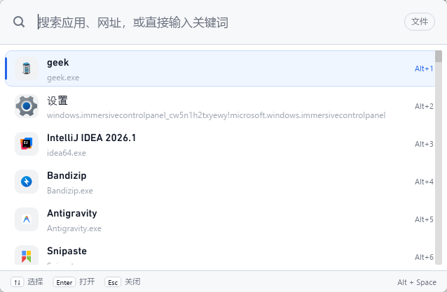

# Kite

**轻量，但搜索足够聪明。**

Kite 是面向 Windows 的原生应用启动器：按下快捷键，输入你记得的那一点信息——完整名称、中文、拼音、首字母、别名，甚至只是模糊印象——把正确的程序排到最前面并直接启动。

它不追求成为功能最多的桌面工具箱，而是优先解决一件事：

> 用户知道自己大概想找什么，但不一定能准确输入完整名称时，Kite 依然能够快速、稳定地把正确结果排在最前面。

<p align="center">
  
</p>

## 为什么是 Kite

| | 常见重启动器 | 常见轻启动器 | **Kite** |
|---|---|---|---|
| 搜索体验 | 好，但常驻偏重 | 轻，中文/简称常不理想 | **中文 · 拼音 · 别名 · 模糊** 一起做对 |
| 资源占用 | 偏高 | 低 | **单进程原生**，无 WebView2 / Node |
| 可扩展性 | 插件很重 | 生态成熟但结果仍可能发散 | **能力外置**：插件独立进程，可卸载，体验留在 Kite |
| 产品重心 | 大而全 | 功能清单 | **搜索准确度 → 响应速度 → 唤起速度** |

技术底座：**Rust + Iced 0.14 + tiny-skia**，不是 Tauri / Electron / WebView2 套壳。

## 界面预览

<p align="center">
  
</p>

全局快捷键呼出搜索窗口；左侧应用图标与名称，右侧快捷序号。输入过程中持续筛选与重排，历史使用与固定项会体现在排序里。

## 核心能力

**启动器本体（始终可用）**

- 全局热键唤起 / 隐藏；系统托盘；多显示器 DPI 下的窗口定位
- 扫描开始菜单、桌面、Scoop、App Paths、UWP / packaged apps 等来源
- Exact / Prefix / Substring / Fuzzy 多路召回，统一评分排序
- 中文、拼音全拼、首字母、用户别名；启动历史、最近使用、固定与降权
- 可选 Everything 文件搜索（含图片 / 文档 / 视频等类型筛选）
- 本地绝对路径直达：打开文件 / 打开所在文件夹
- 网页搜索槽位、常用 Windows 系统入口（回收站、控制面板等）

**官方插件（能力外置，体验内联）**

- 计算器：搜索 `=1+1` 等表达式，Enter 复制结果
- 窗口切换：`win` 列出并切换当前打开的窗口
- 开发者工具：UUID、SHA-256、时间戳、JSON / Base64 独立工具窗

插件是**独立进程**，崩溃或卡顿不拖垮 Kite；删除插件目录后仍是完整启动器。协议不限制语言，详见 [`docs/PLUGIN-DEVELOPMENT.md`](docs/PLUGIN-DEVELOPMENT.md)。

**工程取向**

- 数据默认留在本机：索引、设置、历史、日志均在 `%APPDATA%\com.kite.launcher`
- 启动只执行索引中已验证的 target，不把用户输入拼进 shell
- 性能以代码级基线为主（不依赖反复唤起 UI）测量热路径与故障恢复，见 [`docs/PERFORMANCE.md`](docs/PERFORMANCE.md)

## 系统要求

- Windows 10 / 11 x64
- 无需安装 WebView2 或 Node.js
- 文件搜索可选：需本机已安装并运行 [Everything](https://www.voidtools.com/)

## 下载与安装

从 GitHub Releases 下载 `kite-setup.exe` 并运行。安装器会部署程序与运行资源、创建开始菜单 / 桌面快捷方式，并注册卸载入口。

当前**只发布安装版**，避免便携运行时遗漏 DLL、音效或注册信息。安装包尚未代码签名，Windows 可能提示「未知发布者」；请从本仓库 [Releases](https://github.com/NGLSL/Kite/releases) 下载，并核对发布页上的 SHA-256。

覆盖安装会就地更新；设置、历史、固定项、别名与用户插件一般无需迁移。

## 从源码构建

环境：Rust stable、MSVC 工具链、Visual Studio Build Tools（Desktop development with C++）。打包安装器还需 [NSIS](https://nsis.sourceforge.io/)（`winget install NSIS.NSIS`）。

```powershell
cargo test
cargo build --release
.\scripts\build-installer.ps1
```

`build-installer.ps1` 会先构建官方插件，再编译 release 并生成：

```text
artifacts/kite-setup.exe
```

仅开发主程序时可直接 `cargo build --release`；需要官方插件进包时再跑 `.\scripts\build-official-plugins.ps1`。

## 项目结构

```text
src/app/             应用扫描、UWP、启动
src/search/          规范化、拼音、召回与排序
src/storage/         SQLite 设置、固定项、历史
src/system/          热键、托盘、图标、Everything、窗口定位
src/plugin/          插件 Host / 协议 / 安装
src/ui/              Iced 窗口与交互
official-plugins/    官方插件 Rust workspace（独立进程）
icons/ resources/    图标与运行资源
installer/ scripts/  NSIS 与构建脚本
docs/                需求、性能、插件与开发规范
```

更细的模块职责与修改规则见 [`AGENTS.md`](AGENTS.md) 与 [`docs/DEVELOPMENT.md`](docs/DEVELOPMENT.md)。

## 性能

Kite 为**单进程原生**桌面程序。0.3.7 起默认性能基线走代码路径（搜索热路径、插件故障、Everything 降级、存储升级等），**不必反复唤起 UI**；真窗口唤起延迟保留脚本抽检。

本机实测、复现命令与口径说明见 [`docs/PERFORMANCE.md`](docs/PERFORMANCE.md)。数字随硬件与索引规模变化，请以文档内测量条件为准。

## 插件与扩展

- 用户：设置 → 插件，可启用 / 禁用、重载、导入、重装官方包
- 作者：阅读 [`docs/PLUGIN-DEVELOPMENT.md`](docs/PLUGIN-DEVELOPMENT.md)（Plugin API v1，stdio JSON-RPC）

适合做插件的：删除后 Kite 仍是启动器的能力（计算、窗口切换、编码 / 哈希、翻译、AI 等）。应留在 Core 的：应用索引与启动、URL / 网页搜索、文件搜索集成、历史排序、热键托盘。

## 贡献

提交前请阅读 [`AGENTS.md`](AGENTS.md) 与 [`docs/DEVELOPMENT.md`](docs/DEVELOPMENT.md)，并至少运行：

```powershell
cargo test
cargo build --release
```

Issue / PR 请说明变更内容、验证方式，以及适用的 Windows 环境。涉及窗口、热键、托盘、扫描或启动的修改，编译通过之外还需 Windows 运行验证。

## 开源参考

产品定位与工程实践参考了以下项目：

- [ZeroLaunch-rs](https://github.com/ghost-him/ZeroLaunch-rs/)
- [LaunchyQt](https://github.com/samsonwang/LaunchyQt)
- [Flow Launcher](https://github.com/Flow-Launcher/Flow.Launcher)
- [ZTools](https://github.com/ZToolsCenter/ZTools)

感谢 [LINUX DO](https://linux.do/) 社区对开源项目的支持。

## 隐私

应用索引、设置、启动历史与诊断日志均保存在本机，**无遥测、无统计上报**。

- 「检查更新」会请求 GitHub API；确认下载时从 GitHub Releases 获取安装包
- 网页搜索会把查询发送到用户本机配置的搜索引擎
- Everything 文件搜索走本机 IPC，需用户自行安装并运行 Everything

Kite 不会把本地索引、启动历史或日志发给维护者。用户主动打开的外部网站与应用遵循各自策略。

## 许可证

[Apache License 2.0](LICENSE)

安装包内的 Everything SDK DLL 使用 MIT 许可，原文见 [第三方声明](THIRD_PARTY_NOTICES.txt)。
