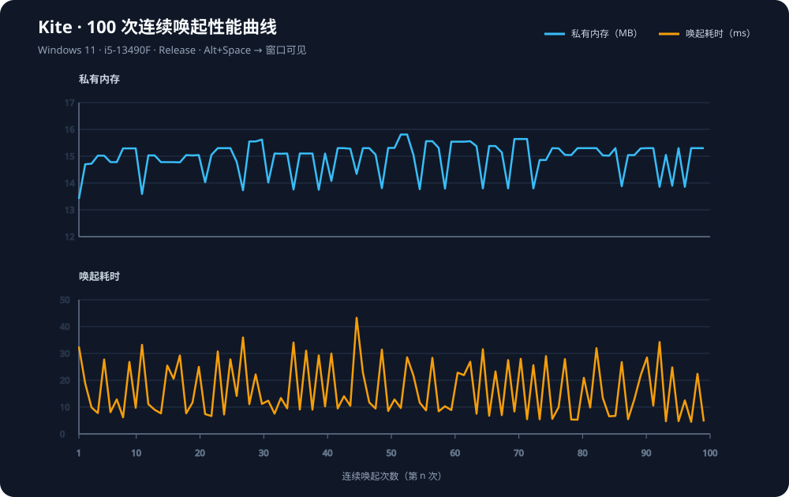

# Kite 性能分析与 Flow Launcher 对比报告

**测量日期：2026-09-14** · **Windows 11 x64 build 26200** · **Intel i5-13490F** · **32 GB RAM**

这份报告合并了 Kite 的 100 次连续唤起实测，以及同机 Flow Launcher 2.1.3 的稳定驻留对比。所有数值均来自本机当前 release 构建；它们是基线数据，不代表所有硬件环境。

## 1. 测试对象与方法

| 项目 | Kite | Flow Launcher |
|---|---|---|
| 版本 | 当前仓库 release | 2.1.3 |
| 技术栈 | Rust + Iced 0.14 + tiny-skia | .NET/WPF + 插件运行时 |
| 唤起方式 | Alt+Space | Alt+Q（Flow 当前配置） |
| 进程模型 | 1 个进程 | 1 个主进程 |
| 内存指标 | PrivateMemorySize64、WorkingSet64 | 同左 |

Kite 的循环测试先启动 release 版本，等待索引完成，然后重复 100 次：发送 Alt+Space、等待 Kite 窗口变为可见、记录耗时和进程内存、发送 Esc 隐藏窗口。每次循环间隔 20 ms。窗口可见性由 Win32 窗口状态读取，耗时包含热键到窗口可见的完整路径。原始数据见 [`performance-kite-100.csv`](performance-kite-100.csv)，曲线见 [`performance-100.svg`](performance-100.svg)。

Flow 用同样的进程内存采样方式，在启动并完成初始化后连续观察 20 秒。Flow 的唤起热键和 Kite 不同，避免两者同时注册同一组合键。

## 2. Kite：100 次连续唤起

| 指标 | 结果 |
|---|---:|
| 样本数 | 100 |
| 唤起耗时平均值 | 16.60 ms |
| 最快 / 最慢 | 4.50 / 43.30 ms |
| P95 / P99 | 32.52 / 35.96 ms |
| 私有内存平均值 | 14.95 MB |
| 私有内存范围 | 13.41–15.81 MB |
| 工作集平均值 | 54.06 MB |
| 工作集范围 | 52.58–54.50 MB |



100 次循环没有出现窗口未唤起或进程退出。第一次及少数高点包含窗口激活、输入法和调度抖动；P95 约为 32.52 ms。应用内部日志还记录了热键消息到更新任务通常约 0.3 ms、空查询排序约 0.15–0.20 ms，这两个数字不等同于用户可见的完整唤起耗时。

## 3. 稳定驻留资源对比

| 指标 | Kite | Flow Launcher 2.1.3 | Kite / Flow |
|---|---:|---:|---:|
| 稳定私有内存 | 14.86 MB | 134.14 MB | 11.1% |
| 稳定工作集 | 47.17 MB | 264.14 MB | 17.9% |
| 20 秒 CPU 增量 | 0 秒 | 0 秒 | 均无可观测增量 |
| 主程序文件 | 7.90 MiB | 0.26 MiB | — |
| 安装目录总大小 | 约 8.3 MB | 246.21 MB | — |

Flow 的主 exe 很小，但安装目录包含 .NET runtime、插件和其他依赖，因此分发体积应看安装目录总大小。两者稳定空闲期间 CPU 都没有可观测增量，不能据此推断连续搜索或插件执行时的 CPU 差异。

## 4. 搜索延迟边界

本次已实测 100 次“热键 → 窗口可见”唤起链路，但没有把真实键盘输入、候选列表首帧和结果绘制做成跨程序自动化测试，因此没有虚构“输入字符 → 结果出现”的 100 次延迟曲线。Kite 内部空查询排序日志仅用于检查搜索引擎耗时，不能替代 UI 端到端数据。

后续若要建立搜索基线，应固定同一批查询词、索引快照和候选数量，分别记录首字符输入到候选列表更新、完整查询输入到最终排序结果、热键唤起到首帧绘制，以及连续 100 次循环的 P50、P95、P99 和内存变化。

## 5. 复现命令

```powershell
cargo test
cargo build --release
.\scripts\build-installer.ps1
```

运行循环采样前请结束旧的 Kite 进程，并等待日志出现 `index ready` 和 `uwp merged`。原始 CSV 保留每次循环的耗时、私有内存和工作集，便于在同一硬件上复核。

## 6. 结论

当前 release 版本在本机 100 次连续唤起中保持稳定，平均唤起耗时 16.60 ms，P95 为 32.52 ms；稳定私有内存约 14.86 MB。与同机 Flow Launcher 2.1.3 的稳定驻留值相比，Kite 的私有内存约为 11%，工作集约为 18%。这支持 Kite 的轻量原生定位，但不代表两者功能和插件覆盖相同。


