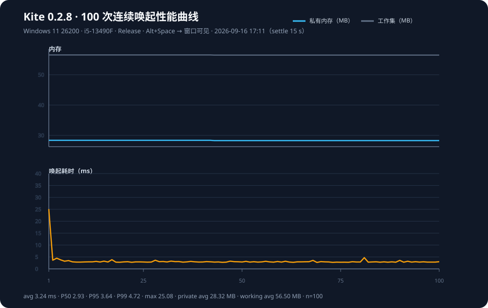

# Kite 性能分析报告

**测量日期：2026-09-16** · **Windows 11 x64 build 26200** · **Intel i5-13490F** · **32 GB RAM** · **Rust 1.97.1**

本版覆盖当前仓库 release（v0.2.8 + 单例启动、search-service-hardening、交互日志闸门等未发布改动）的 100 次连续唤起实测与空闲驻留资源。**最新一轮为当日 17:11**（下文各表首列）；同日上午 01:17 与 2026-09-14 两轮作为对照。数值来自本机当前构建，是基线数据，不代表所有硬件环境。

> ⚠️ **口径变更**：本轮修正了静默 CPU 的测量方式。旧报告的 `idle_cpu_delta_s` 实际量到了「索引发布之后的收尾工作」而不是静默期，详见 §6。比较 CPU 一行时请看量级，不要当作严格回归结论。

## 1. 测试对象与方法

| 项目 | 本轮（17:11） |
|---|---|
| 版本 | 当前仓库 `cargo build --release`（ProductVersion 0.2.8） |
| 索引规模 | 本机扫描 **299** 条应用 |
| 唤起方式 | 全局热键 Alt+Space → Win32 窗口可见 → Esc 隐藏 |
| 循环 | 100 次，间隔 20 ms |
| 内存指标 | `PrivateMemorySize64`、`WorkingSet64` |
| 静默 CPU | 索引就绪后再等 **15 s**（SettleSeconds）让收尾工作结束，再采样 20 秒 `TotalProcessorTime` 增量 |
| 搜索引擎 | `cargo test --release bench -- --ignored --nocapture`（合成索引 80 / 2000） |

复现：

```powershell
cargo build --release
.\scripts\measure-performance.ps1 -Iterations 100 -IdleSeconds 20 -SettleSeconds 15
cargo test --release bench -- --ignored --nocapture
```

原始数据（本轮）：[`performance-kite-20260916-171118.csv`](performance-kite-20260916-171118.csv)，汇总 JSON：[`performance-kite-20260916-171118.summary.json`](performance-kite-20260916-171118.summary.json)，曲线：[`performance-100-20260916-171118.svg`](performance-100-20260916-171118.svg)。
上一轮（01:17）：[`performance-kite-100.csv`](performance-kite-100.csv)、[`performance-kite-20260916-011716.summary.json`](performance-kite-20260916-011716.summary.json)、[`performance-100.svg`](performance-100.svg)。2026-09-14 基线：[`performance-kite-100-20260914.csv`](performance-kite-100-20260914.csv)。

## 2. 100 次连续唤起

| 指标 | 17:11（当前） | 01:17（上午） | 2026-09-14 基线 |
|---|---:|---:|---:|
| 样本数 | 100 | 100 | 100 |
| 唤起平均 | **3.24 ms** | 3.91 ms | 16.60 ms |
| 最快 / 最慢 | 2.70 / 25.08 ms | 3.33 / 32.58 ms | 4.50 / 43.30 ms |
| P50 / P95 / P99 | **2.93 / 3.64 / 4.72 ms** | 3.60 / 4.03 / 4.59 ms | — / 32.52 / 35.96 ms |
| 私有内存平均 | **28.32 MB** | 59.69 MB | 14.95 MB |
| 私有内存范围 | 28.28–28.37 MB | 59.62–59.72 MB | 13.41–15.81 MB |
| 工作集平均 | **56.50 MB** | 78.87 MB | 54.06 MB |
| 工作集范围 | 56.47–56.52 MB | 78.84–78.90 MB | 52.58–54.50 MB |



说明：

- 首样本 25.08 ms，其后稳定在约 2.7–5 ms；平均与 P50 都低于上午那轮，P95 由 4.03 ms 收到 3.64 ms。
- **私有内存相对上午那轮接近腰斩**：59.69 → 28.32 MB（约 −53%），工作集 78.87 → 56.50 MB（约 −28%）。100 次内区间极窄（28.28–28.37 MB），末次 28.28 MB 不高于首样本，未见泄漏式爬升。
- 构建体积反而变大（9,541,632 → 9,597,440 B），内存却下降，说明收益来自检索/索引的驻留结构而非体积裁剪。
- 跨轮对比看数量级，不把 3.24 ms 与 3.91 ms 当成严格同口径回归结论。

## 3. 驻留资源与体积

| 指标 | 17:11（当前） | 01:17（上午） | 2026-09-14 基线 |
|---|---:|---:|---:|
| 静默 20 秒 CPU 增量（先等 15 s 收尾） | **0.094 s**（约 0.47% 单核） | 0.031 s（口径见 §6，不可直接比） | 0 s |
| 静默私有内存 | **28.37 MB** | 59.72 MB | 14.86 MB |
| 静默工作集 | **56.52 MB** | 78.90 MB | 47.17 MB |
| `kite.exe` | **9.15 MiB**（9,597,440 B） | 9.10 MiB（9,541,632 B） | 7.90 MiB |
| 本机索引条数 | 299 | 297 | （上轮未在报告中写明） |

功能堆叠带来的驻留成本已明显回落：上午那轮相对 09-14 基线的私有内存 +45 MB 抬升，本轮已降到 28 MB 量级。静默 CPU 仍可忽略（0.47% 单核），100 次唤起路径未出现随循环恶化。

## 4. 搜索引擎延迟（release bench）

本节数据来自 01:17 那一轮的 release bench，**本轮未重跑**。合成索引，单位 µs，QPS = 每秒可完成查询次数。

### 索引 80 条（接近本机规模）

| 查询类型 | query | p50 | p95 | max | QPS |
|---|---|---:|---:|---:|---:|
| exact-en | `chrome` | 82.2 | 132.6 | 373.8 | 11092 |
| prefix-en | `vis` | 64.6 | 96.3 | 2878.4 | 12802 |
| fuzzy-en | `chorme` | 82.6 | 111.5 | 159.8 | 11573 |
| substring-en | `studio` | 88.9 | 148.4 | 227.9 | 10062 |
| exact-zh | `微信` | 14.2 | 21.1 | 1356.2 | 50580 |
| pinyin-full | `weixin` | 89.5 | 142.5 | 200.0 | 9825 |
| pinyin-initial | `wxkf` | 57.0 | 81.0 | 117.2 | 16688 |
| pinyin-initial-short | `wx` | 56.5 | 84.9 | 137.8 | 15837 |
| one-char | `v` | 9.7 | 12.4 | 16.6 | 100220 |
| no-hit | `zzzzqq` | 61.7 | 110.6 | 207.2 | 14610 |
| empty-query | `(打开启动器)` | 38.3 | 66.2 | 124.1 | 22948 |
| index-build | (快照) | 9947 | | | |

### 索引 2000 条（压力档）

| 查询类型 | query | p50 | p95 | max | QPS |
|---|---|---:|---:|---:|---:|
| exact-en | `chrome` | 81.7 | 86.0 | 188.4 | 12048 |
| prefix-en | `vis` | 65.5 | 68.8 | 145.0 | 15042 |
| fuzzy-en | `chorme` | 82.9 | 90.2 | 216.3 | 11772 |
| substring-en | `studio` | 88.5 | 95.4 | 272.0 | 11046 |
| exact-zh | `微信` | 15.8 | 17.2 | 780.7 | 54062 |
| pinyin-full | `weixin` | 89.1 | 97.0 | 158.8 | 11030 |
| pinyin-initial | `wxkf` | 56.9 | 58.3 | 94.7 | 17464 |
| pinyin-initial-short | `wx` | 121.2 | 136.6 | 297.2 | 8000 |
| one-char | `v` | 27.6 | 30.9 | 38.9 | 35596 |
| no-hit | `zzzzqq` | 61.7 | 64.4 | 127.3 | 15994 |
| empty-query | `(打开启动器)` | 94.7 | 98.7 | 173.2 | 10399 |
| index-build | (快照) | 1772979 | | | |

要点：

- 常用查询（exact/prefix/fuzzy/pinyin）在 80 与 2000 档都在约 0.06–0.15 ms 量级，远低于一帧。
- 单字符与中文 exact 更快；`wx` 在 2000 档升到约 0.12 ms，仍可接受。
- 空查询（打开启动器）80 档 p50 约 38 µs，2000 档约 95 µs。
- 索引快照构建：80 条约 10 ms，2000 条约 1.77 s（一次性路径，不在按键热路径上）。

Windows 设置标准词路径（46 入口）额外见 `cargo test --release system_vocabulary_latency`：`文件` 这类短词在 baseline/enriched 下均为数十 µs 级；`activation` 等长英文词约 0.7–0.8 ms。

## 5. 结论

1. **速度**：本机 release 在索引就绪后，Alt+Space 唤起 P50 约 **2.9 ms**、P95 约 **3.6 ms**；搜索引擎按键路径普遍 **&lt;0.2 ms**（§4，01:17 轮数据）。
2. **内存**：空闲私有内存约 **28.3 MB**、工作集约 **56.5 MB**；相对同日上午那轮的 59.7 / 78.9 MB 分别下降约 **53% / 28%**，是本轮最明显的改善。100 次唤起无泄漏爬升。
3. **CPU**：扣除索引发布之后的收尾（约 4–5 s，见 §6）后，静默 20 秒 CPU 增量约 **0.094 s**（0.47% 单核），可视为无后台空转。
4. **未覆盖**：输入字符到结果列表更新的端到端 UI 延迟仍未自动化；Everything 文件模式、多显示器 DPI 切换、安装器升级路径不在本轮范围。

## 6. 方法与数据修订（本轮）

本轮首次在本机把 `scripts/measure-performance.ps1` 自动化跑通，过程中修掉两个会让静默 CPU 失真的测量缺陷：

1. **就绪判据失效**。`Wait-IndexReady` 原先要求日志里出现 `pid=<pid>`，而应用从不记录 pid，于是退化为「tail 里存在任意一条 `index complete` 就算就绪」——那通常来自上一次运行，函数**立刻返回**。现改为**只认启动前记录的文件偏移之后新增的 `index complete`**（日志被裁剪时回退为从头读），改用字节偏移读取，不再依赖 tail。
2. **收尾工作污染静默窗口**。实测应用在 `index complete` 之后仍有约 **4.6 秒**的 CPU 收尾（图标缓存落盘、检索结构预热、entry watch 首轮，期间无日志输出）。分段采样的原始证据：紧跟发布之后的 10 秒窗口 `+4.641 s`，其后三个 10 秒窗口分别为 `+0.016 s`、`+0.062 s`、`+0.031 s`。因此新增 `-SettleSeconds`（默认 15），等收尾结束再取静默基线，并把这个值记进汇总 JSON 以便日后比对口径。

修复前后对照（同一构建、均为 100 次）：

| 运行 | 静默窗口起点 | `idle_cpu_delta_s` |
|---|---|---:|
| 17:01（未修就绪判据） | 启动后约 1.5 s，落在全量扫描之内 | 4.172 s |
| 17:07（修了就绪判据，未加稳定期） | `index complete` 后约 1.5 s，落在收尾之内 | 3.391 s |
| 17:11（就绪判据 + 15 s 稳定期） | 收尾结束之后 | **0.094 s** |

结论：应用在收尾结束之后确实近乎完全空闲；旧报告的 0.031 s 更小，**推测**那一轮启动时命中了扫描缓存（未做全量扫描），静默窗口因此落在收尾之外——但该日志已被滚动裁掉，无法复核。因此 §3 的 CPU 一行只作量级参考。

上表中间两轮（17:01 / 17:07）是定位过程中的临时运行，口径有缺陷，其原始文件未入库；数值仅记录于此，便于日后判断本文件里旧的 0.031 s 为什么偏小。
